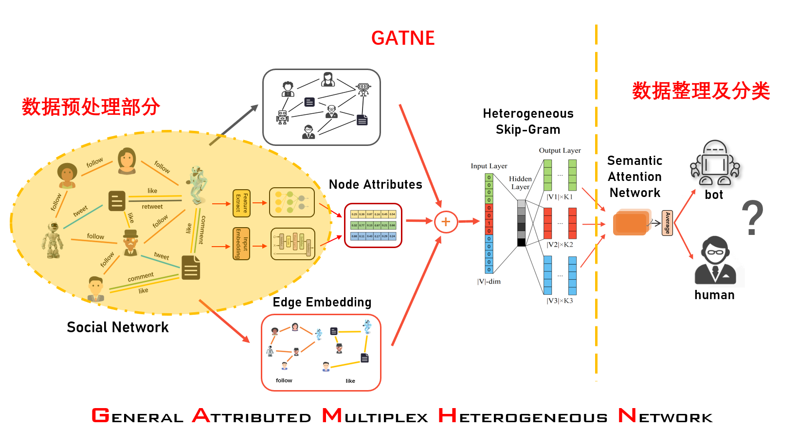

GAMHN
===========

## 一、数据预处理部分
### 有两种方式
* 一种是直接修改源代码的数据输入部分
* 一种是按照数据接入格式生成文件，然后传入文件
### 第二种
对twibot-20数据集进行数据预处理，主要生成五个文件
- train.txt: Each line represents an edge, which contains three tokens `<edge_type> <node1> <node2>` where each token can be either a number or a string.
- valid.txt: Each line represents an edge or a non-edge, which contains four tokens `<edge_type> <node1> <node2> <label>`, where `<label>` is either 1 or 0 denoting an edge or a non-edge
- test.txt: the same format with valid.txt
- feature.txt (optional): First line contains two number `<num> <dim>` representing the number of nodes and the feature dimension size. From the second line, each line describes the features of a node, i.e., `<node> <f_1> <f_2> ... <f_dim>`.
- node_type.txt: Each line contains two tokens `<node> <node_type>`, where `<node_type>` should be consistent with the meta-path schema in the training command, i.e., `--schema node_type_1-node_type_2-...-node_type_k-node_type_1`. (Note that the first node type in the schema should equals to the last node type.)

## 二、GATNE部分
### 模型架构
将用户与推文均考虑为节点
* 用户：特征提取形成表示向量
* 推文：利用transformer提取信息形成表示向量  

形成`feature.txt`文件
其余与原模型相同

### 模型实现
先按源代码执行

## 三、数据整理及分类器实现
#### 1、数据整理
GATNE模型输出的是每个节点n关于每种边类型r的一个表示向量，即`V(n,r)`， 
利用`semantic attention network`生成每个表示向量的权重，再聚合在一起，为每个用户生成一个向量（注意这里只对用户生成，不包括推文）  
经过神经网络输出二维向量，即用户概率、机器人概率

